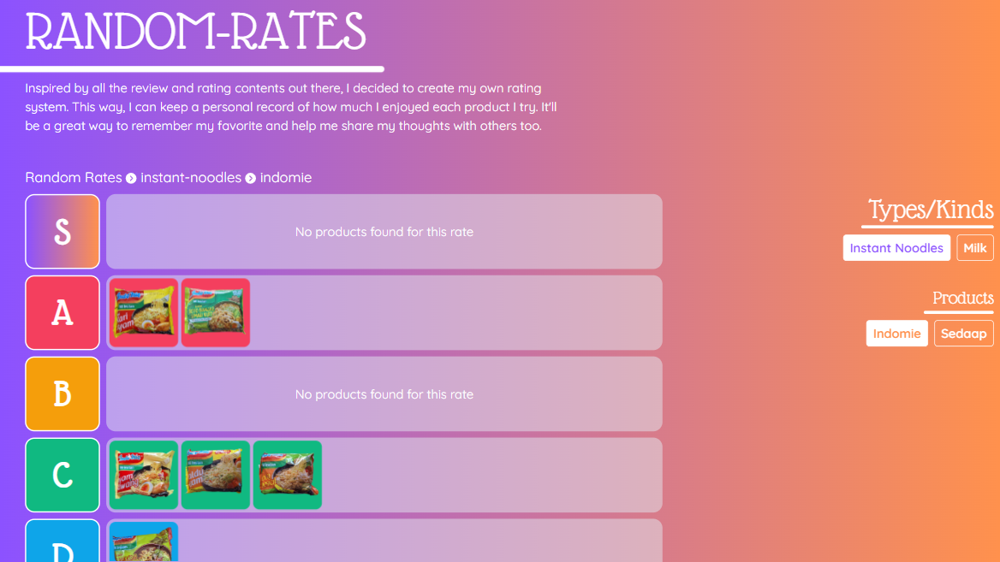

    

# <h3 align="center">Random Rate</h3>

---

    My own rating system to keep my record of how much I enjoyed each product I try. Doing this just for fun. 
      

</a>

##  Rate List

| Rate                 | Description |
| -------------------- | ----------- |
| ${\color{purple}S}$  | The best taste there is 💜|
| ${\color{red}A}$     | Would love to have more   |
| ${\color{orange}B}$  | Fine, i guess             |
| ${\color{green}C}$   | The bare minimum          |
| ${\color{skyblue}D}$ | Meh                       |
| ${\color{grey}E}$    | Nope                      |
| ${\color{black}F}$   | Just don't 💀             |

## Things I've rated so far

- Instant Noodle
  - Indomie
  - Sedaap

Many more to go!
